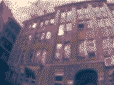
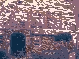
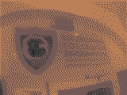
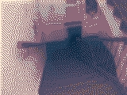
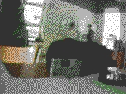
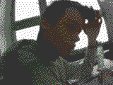

# PixCam
Te repozytorium zawiera pliki związane z kodem PixCama.

## Krótki opis
PixCam to kamera bazowana na ESP32-S3, która robi zdjęcia w stylu konsol retro.

### Cel projektu
Celem projektu jest stworzenie osobnego przenośnego urządzenia do robienia zdjęć w celu utrwalania momentów życia w stylu artystycznym, niespotykanym spośród innych urządzeń tego typu.

### Zastosowanie projektu
Zastosowaniem tego urządzenia jest fotografia codzienna, np. zdjęcia pupili, krajobrazów, selfie (samemu lub w grupie) lub wydarzeń.

## Przykładowe zdjęcia
> Zdjęcia budynku SCI 

 
> Zdjęcie logo SCI nad wejściem 

 
> Zdjęcie schodów 

 
> Zdjęcie sali szkolnej 

 

> Zdjęcie ucznia siedzącego w ławce podczas lekcji 

> Zdjęcie ucznia w pracowni komputerowej 

## Specyfikacja kamery
- Procesor: ESP32-S3
- Pamięć flash: 16MB
- PSRAM: 8MB
- Sensor kamery: OV5640
- Ekran: SSD1306 (128x64)
- Pamięć: karta microSD (16GB)

## Jak działa robienie zdjęć
Aby zrobić zdjęcie, sensor najpierw reinitializuje się w rozdzielczości 320x240, przechwytuje framebuffer, który jest potem przekształcony z formatu RGB565 do RGB888, następnie przechodzi przez ditherowanie Floyd-Steinberga z kolorami ograniczonymi do tych z wybranej palety kolorów. Potem jest to konwertowane to pliku JPEG, który następnie zostaje zapisany na karcie microSD. Następnie sensor reinitializuje się ponownie w niższej rozdzielczości dla podglądu.

## Nasze plany
- [x] Zrobić kamerę
- [ ] Wygrać (albo przynajmniej top 3) SCI++
